# 📋 Phân Tích Flow Frontend — HomeFeel Appointment Booking System

> **Project**: `homefeel-appointment-booking-fe`  
> **Tech Stack**: React 19 + TypeScript + Vite + Ant Design 5 + Redux Toolkit + React Router 7 + TailwindCSS 3 + Axios  
> **Ngày phân tích**: 10/07/2026

---

## 1. Tổng Quan Kiến Trúc

### 1.1 Cấu trúc thư mục (Feature-Sliced Architecture)

```
src/
├── app/                     # 🏗️ Application layer (bootstrap, providers, router, redux)
│   ├── init/                #    App initialization (session check)
│   ├── layouts/             #    Layout wrappers (MainLayout, AppRootLayout)
│   ├── providers/           #    Provider composition (Redux + AntD + Router)
│   ├── redux/               #    Redux store configuration & typed hooks
│   └── router/              #    Route definitions & ProtectedRoute guard
│
├── features/                # 🧩 Feature modules (domain-driven, self-contained)
│   ├── auth/                #    Đăng nhập / Đăng kí / Quên MK / Google OAuth
│   ├── users/               #    Quản lý user hiện tại (profile, avatar)
│   ├── home/                #    Trang chủ (Hero, Reviews, About preview)
│   ├── public-services/     #    Danh sách & chi tiết dịch vụ (public)
│   ├── appointments/        #    Lịch hẹn / Đặt lịch (mock data)
│   ├── promotions/          #    Khuyến mãi (public view)
│   ├── profile/             #    Hồ sơ cá nhân
│   ├── about/               #    Giới thiệu
│   ├── dashboard/           #    Dashboard layout + pages (Admin & Staff)
│   ├── admin-users/         #    Admin: CRUD users
│   ├── admin-services/      #    Admin: CRUD dịch vụ
│   ├── admin-categories/    #    Admin: CRUD danh mục
│   ├── admin-promotions/    #    Admin: CRUD khuyến mãi
│   ├── admin-reviews/       #    Admin: Quản lý đánh giá
│   ├── admin-blocked-slots/ #    Admin: Khóa slot lịch
│   ├── admin-staff-shifts/  #    Admin: Ca làm việc nhân viên
│   └── admin-staff-services/#    Admin: Phân công nhân viên-dịch vụ
│
├── shared/                  # 🔧 Shared layer (cross-cutting concerns)
│   ├── components/          #    Reusable UI (DataTable, AppPagination, AppSelect, AppRouteError)
│   ├── constants/           #    Brand constants
│   ├── hooks/               #    Custom hooks (useTable)
│   ├── lib/                 #    Axios client (interceptors, token refresh)
│   ├── theme/               #    Ant Design theme config
│   ├── types/               #    API response types, filter params
│   └── utils/               #    Utilities (api-error, asset-url, avatar, pagination, select)
│
├── styles/                  # 🎨 Global CSS
│   └── global.css
│
└── main.tsx                 # 🚀 Entry point
```

### 1.2 Mỗi Feature Module tuân theo cấu trúc chuẩn

```
features/<feature-name>/
├── api/          # API functions (gọi axiosClient)
├── components/   # UI components riêng của feature
├── constants/    # Hằng số, mock data
├── mappers/      # Transform API response → FE model
├── pages/        # Page-level components (render bởi router)
├── store/        # Redux slice + async thunks (nếu cần global state)
├── types/        # TypeScript interfaces/types
└── utils/        # Utility functions riêng
```

> **Lưu ý**: Không phải feature nào cũng có đủ tất cả thư mục — chỉ tạo khi cần.

---

## 2. Flow Khởi Động Ứng Dụng (Application Bootstrap)

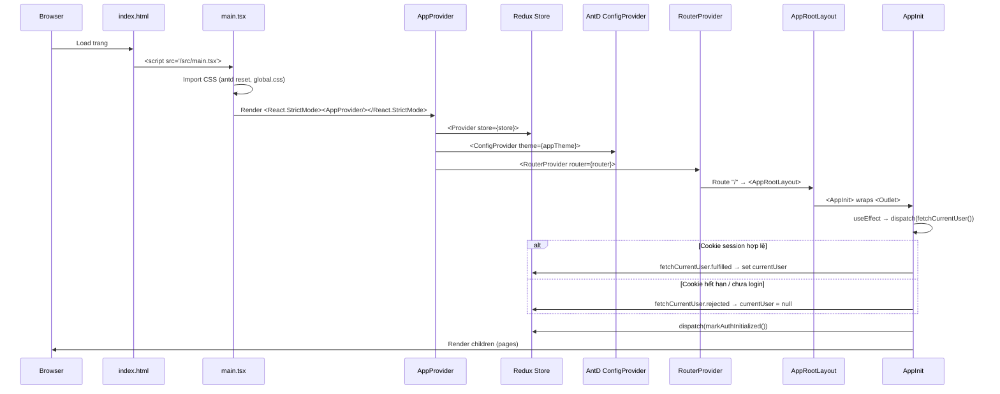

### Chi tiết từng bước:

| Bước | File | Mô tả |
|------|------|--------|
| 1 | [index.html](file:///e:/Dev/source%20code/YoEdu/Appointment_Booking_System_FE/index.html) | HTML shell, mount `<div id="root">`, load `main.tsx` |
| 2 | [main.tsx](file:///e:/Dev/source%20code/YoEdu/Appointment_Booking_System_FE/src/main.tsx) | Import CSS, render `<AppProvider>` vào `#root` |
| 3 | [AppProvider.tsx](file:///e:/Dev/source%20code/YoEdu/Appointment_Booking_System_FE/src/app/providers/AppProvider.tsx) | Compose 3 providers: Redux → AntD Theme → Router |
| 4 | [AppRootLayout.tsx](file:///e:/Dev/source%20code/YoEdu/Appointment_Booking_System_FE/src/app/layouts/AppRootLayout.tsx) | Root route layout, wraps `<Outlet>` bằng `<AppInit>` |
| 5 | [AppInit.tsx](file:///e:/Dev/source%20code/YoEdu/Appointment_Booking_System_FE/src/app/init/AppInit.tsx) | **Session bootstrap**: gọi `fetchCurrentUser()`, hiện Spin loading cho đến khi `initialized = true`. Đồng thời lắng nghe event `auth:expired` để clear user |

---

## 3. Provider Hierarchy (Cây Provider)

```
<React.StrictMode>
  └── <Provider store={store}>              ← Redux Store
       └── <ConfigProvider theme={appTheme}> ← Ant Design Theme
            └── <RouterProvider router={router}>
                 └── <AppRootLayout>          ← Root route element
                      └── <AppInit>           ← Session bootstrap
                           └── <Outlet />     ← Render child routes
```

### Redux Store Configuration

```
store
├── auth    ← authSlice (initialized, loading, error, sessionVersion)
└── users   ← userSlice (currentUser, loading, error)
```

| Slice | File | State | Mô tả |
|-------|------|-------|--------|
| `auth` | [auth-slice.ts](file:///e:/Dev/source%20code/YoEdu/Appointment_Booking_System_FE/src/features/auth/store/auth-slice.ts) | `initialized`, `loading`, `error`, `sessionVersion` | Quản lý trạng thái auth flow. `sessionVersion` tăng khi login/register thành công → trigger `AppInit` re-fetch user |
| `users` | [user-slice.ts](file:///e:/Dev/source%20code/YoEdu/Appointment_Booking_System_FE/src/features/users/store/user-slice.ts) | `currentUser`, `loading`, `error` | Lưu thông tin user đang đăng nhập. Tự clear khi `logout` |

---

## 4. Hệ Thống Routing

### 4.1 Sơ đồ Route Tree

```mermaid
graph TD
    ROOT["/ (AppRootLayout + AppInit)"]
    
    ROOT --> AUTH_RESET["auth/reset-password → ResetPasswordPage"]
    ROOT --> AUTH_GOOGLE["auth/google-callback → GoogleCallbackPage"]
    
    ROOT --> MAIN["(MainLayout: Header + Footer)"]
    MAIN --> HOME["/ (index) → HomePage"]
    MAIN --> SERVICES["services → ServicesPage"]
    MAIN --> SERVICE_DETAIL["services/:serviceId → ServiceDetailPage"]
    MAIN --> PROMOTIONS["promotions → PromotionsPage"]
    MAIN --> ABOUT["about → AboutPage"]
    MAIN --> PROFILE["profile → 🔒 ProfilePage"]
    MAIN --> BOOKING["booking-history → 🔒 AppointmentHistoryPage"]
    
    ROOT --> STAFF_DASH["staff/dashboard → 🔒 STAFF DashboardLayout"]
    STAFF_DASH --> STAFF_INDEX["(index) → StaffDashboardPage"]
    
    ROOT --> ADMIN_DASH["admin/dashboard → 🔒 ADMIN DashboardLayout"]
    ADMIN_DASH --> ADMIN_INDEX["(index) → AdminDashboardPage"]
    ADMIN_DASH --> ADMIN_USERS["users → AdminUsersPage"]
    ADMIN_DASH --> ADMIN_PROMO["promotions → AdminPromotionsPage"]
    ADMIN_DASH --> ADMIN_REVIEWS["reviews → AdminReviewsPage"]
    ADMIN_DASH --> ADMIN_SERVICES["services → AdminServicesPage"]
    ADMIN_DASH --> ADMIN_CATEGORIES["categories → AdminCategoriesPage"]
    ADMIN_DASH --> ADMIN_LOCKS["schedule-locks → AdminBlockedSlotsPage"]
    ADMIN_DASH --> ADMIN_SHIFTS["work-shifts → AdminStaffShiftsPage"]
    ADMIN_DASH --> ADMIN_ASSIGN["staff-assignments → AdminStaffServicesPage"]
    ADMIN_DASH --> ADMIN_SLOT_LOCKS["slot-locks → AdminBlockedSlotsPage"]

    style ROOT fill:#214f45,color:#fff
    style MAIN fill:#3f8a65,color:#fff
    style STAFF_DASH fill:#c6862f,color:#fff
    style ADMIN_DASH fill:#c94c4c,color:#fff
```

### 4.2 Hai Layout chính

| Layout | File | Mô tả |
|--------|------|--------|
| **MainLayout** | [MainLayout.tsx](file:///e:/Dev/source%20code/YoEdu/Appointment_Booking_System_FE/src/app/layouts/MainLayout.tsx) | Public layout: Sticky Header (logo, nav menu, login/user dropdown) + Content `<Outlet>` + Footer + AuthModal |
| **DashboardLayout** | [DashboardLayout.tsx](file:///e:/Dev/source%20code/YoEdu/Appointment_Booking_System_FE/src/features/dashboard/components/DashboardLayout.tsx) | Admin/Staff layout: Collapsible Sider (avatar, nav menu, logout) + Top bar + Content `<Outlet>` |

### 4.3 ProtectedRoute Guard

File: [ProtectedRoute.tsx](file:///e:/Dev/source%20code/YoEdu/Appointment_Booking_System_FE/src/app/router/ProtectedRoute.tsx)

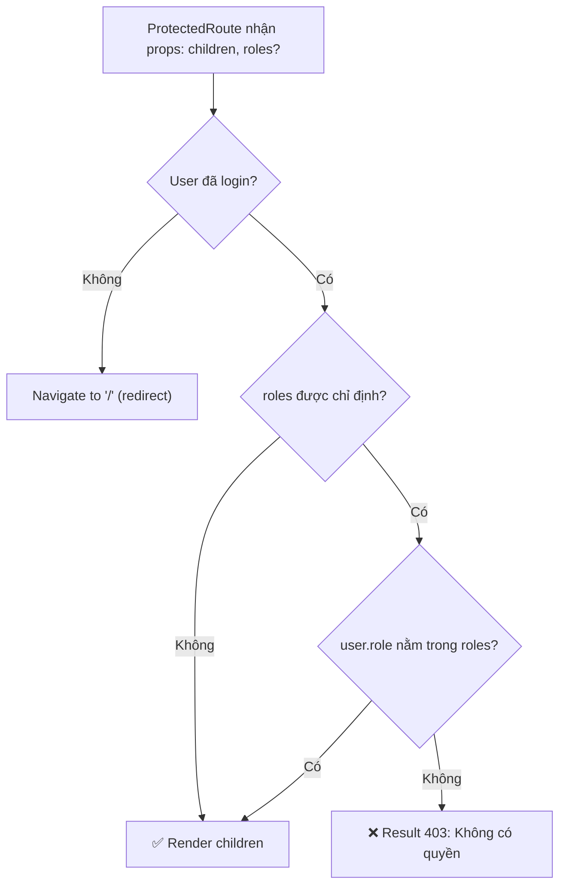

**3 mức bảo vệ:**
- **Không có `roles`**: Chỉ cần đăng nhập (VD: `/profile`, `/booking-history`)
- **`roles={['STAFF']}`**: Chỉ cho Staff (VD: `/staff/dashboard`)
- **`roles={['ADMIN']}`**: Chỉ cho Admin (VD: `/admin/dashboard/*`)

---

## 5. Flow Xác Thực (Authentication)

### 5.1 Tổng quan Auth Architecture

```
Xác thực dựa trên HttpOnly Cookie (withCredentials: true)
├── Không lưu token ở localStorage/sessionStorage
├── Cookie được set/clear bởi Backend
├── FE chỉ gọi API, cookie tự động gửi kèm
└── Token refresh qua interceptor tự động
```

### 5.2 Flow Đăng Nhập (Email/Password)

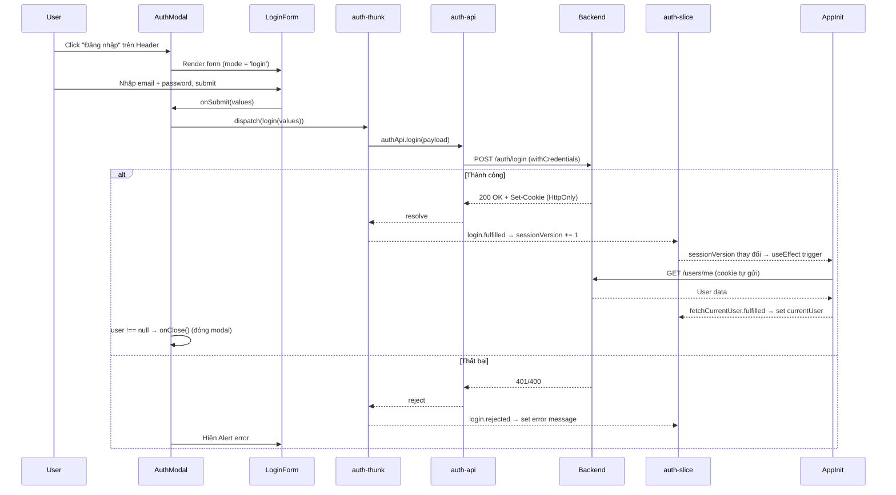

### 5.3 Flow Đăng Kí (với OTP verification)

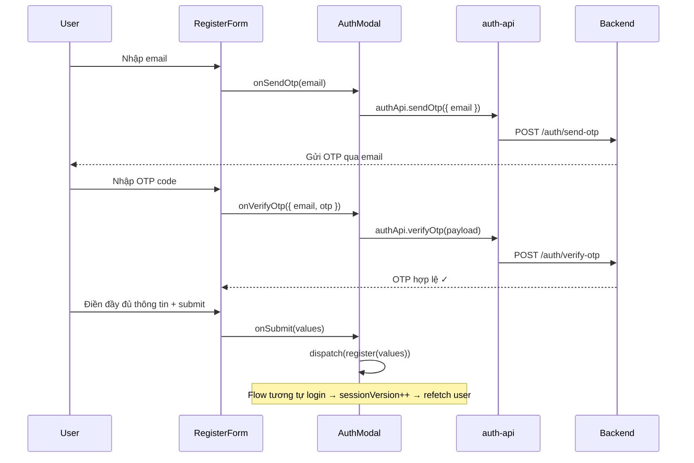

### 5.4 Flow Google OAuth

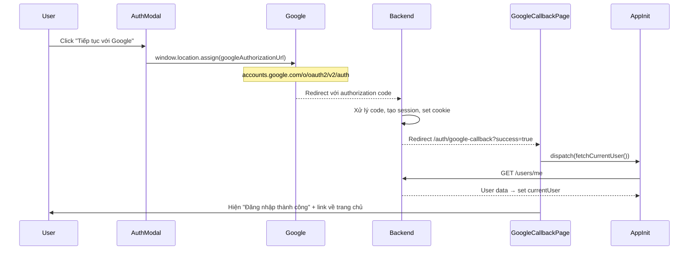

### 5.5 Flow Token Refresh (Tự động)

File: [axios.ts](file:///e:/Dev/source%20code/YoEdu/Appointment_Booking_System_FE/src/shared/lib/axios.ts)

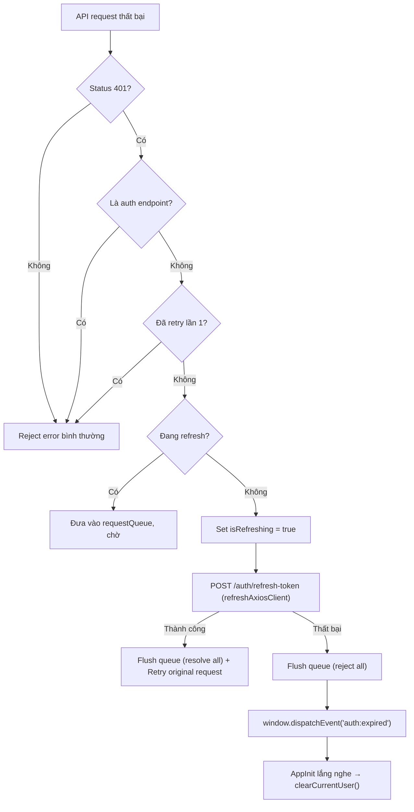

**Điểm đáng chú ý:**
- Dùng **2 axios instances** riêng biệt: `axiosClient` (có interceptors) và `refreshAxiosClient` (không có interceptors) để tránh vòng lặp refresh vô hạn
- **Request queue**: Khi token đang refresh, các request 401 khác được xếp hàng chờ, không gọi refresh đồng thời
- **Event-based logout**: Khi refresh thất bại, dispatch DOM event `auth:expired` → `AppInit` lắng nghe và clear user

### 5.6 Flow Quên Mật Khẩu & Reset Password

```
1. User nhấn "Quên mật khẩu?" → AuthModal switch mode='forgot-password'
2. ForgotPasswordForm: nhập email → POST /auth/forgot-password
3. Backend gửi email chứa link reset (có token)
4. User click link → /auth/reset-password?token=xxx
5. ResetPasswordPage: nhập mật khẩu mới → POST /auth/reset-password { token, newPassword }
```

---

## 6. Flow Dữ Liệu (Data Flow Pattern)

### 6.1 Pattern chung cho các trang có API

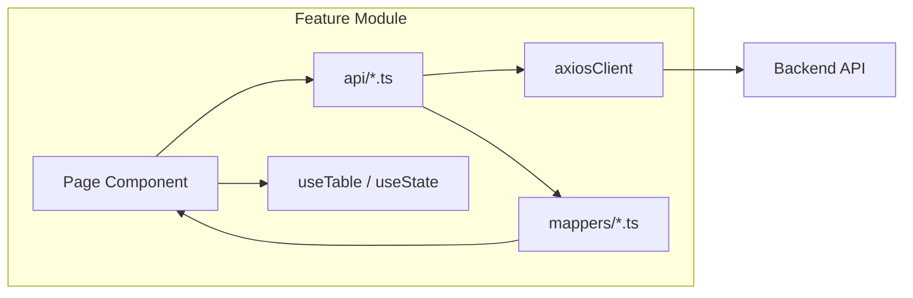

### 6.2 Hai pattern chính

#### Pattern A: Redux Thunk (Global State)
> Dùng cho: Auth, Current User — state cần chia sẻ giữa nhiều component

```
Component → dispatch(thunk) → thunk gọi API → slice update state → Component re-render
```

| Flow | Thunk | API | Slice |
|------|-------|-----|-------|
| Login | `login()` | `authApi.login()` | `auth-slice` |
| Register | `register()` | `authApi.register()` | `auth-slice` |
| Logout | `logout()` | `authApi.logout()` | `auth-slice` + `user-slice` |
| Fetch User | `fetchCurrentUser()` | `userApi.getMe()` | `user-slice` |

#### Pattern B: Local State + API trực tiếp (Feature-scoped)
> Dùng cho: Services, Promotions, Admin CRUD — state chỉ cần trong 1 page

```
Page Component → useState/useTable → gọi API function trực tiếp → set local state
```

**`useTable` hook** ([useTable.ts](file:///e:/Dev/source%20code/YoEdu/Appointment_Booking_System_FE/src/shared/hooks/useTable.ts)):
- Generic hook cho bảng dữ liệu phân trang
- Quản lý: `items`, `total`, `currentPage`, `pageSize`, `filters`, `loading`, `error`
- Auto-fetch khi params thay đổi
- Cung cấp: `handlePageChange`, `handleFilterChange`, `resetFilters`, `refetch`

### 6.3 API Response Contract

```typescript
// Response chuẩn
interface ApiResponse<T> {
  success: boolean;
  message: string;
  data: T;
}

// Response chỉ có message
interface ApiMessageResponse {
  success: boolean;
  message: string;
  data?: unknown;
}

// Response phân trang
interface PaginatedData<T> {
  items: T[];
  total: number;
  page: number;
  limit: number;
}
```

### 6.4 Data Mapper Pattern

API response từ Backend thường khác model trên FE. Dùng **mapper** để transform:

```
Backend Response (CurrentUserData)     →     FE Model (User)
─────────────────────────────────────────────────────────────
userId                                 →     id
userName                               →     fullName
picture                                →     avatarUrl
phoneNumber                            →     phone
isReceiveEmail / receiveEmail          →     receiveEmail
```

File: [user-mapper.ts](file:///e:/Dev/source%20code/YoEdu/Appointment_Booking_System_FE/src/features/users/mappers/user-mapper.ts)

---

## 7. Flow Các User Journey Chính

### 7.1 Guest User — Duyệt Dịch Vụ & Đặt Lịch

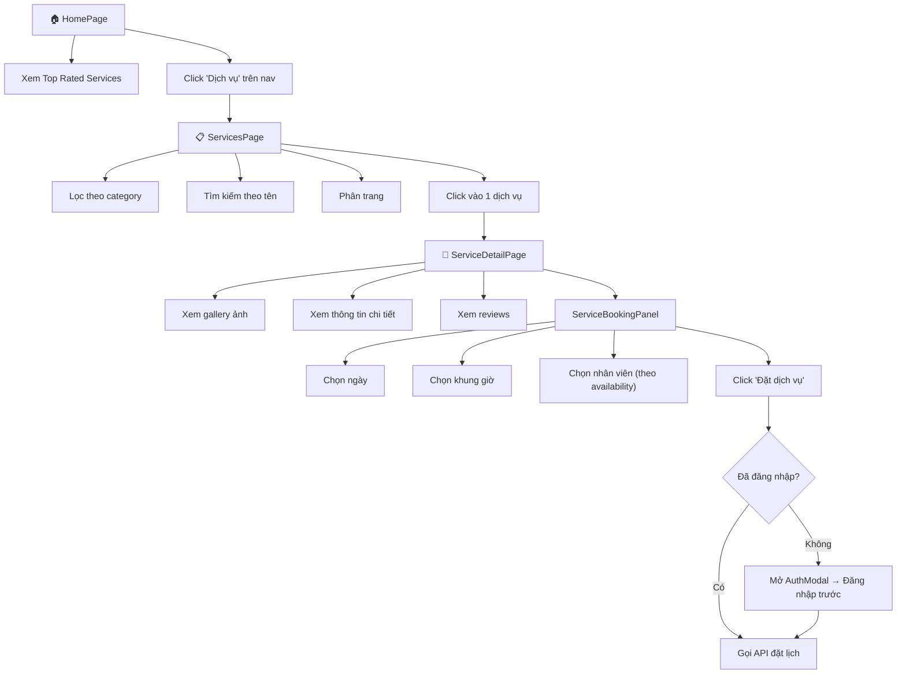

### 7.2 Customer — Quản Lý Lịch Hẹn

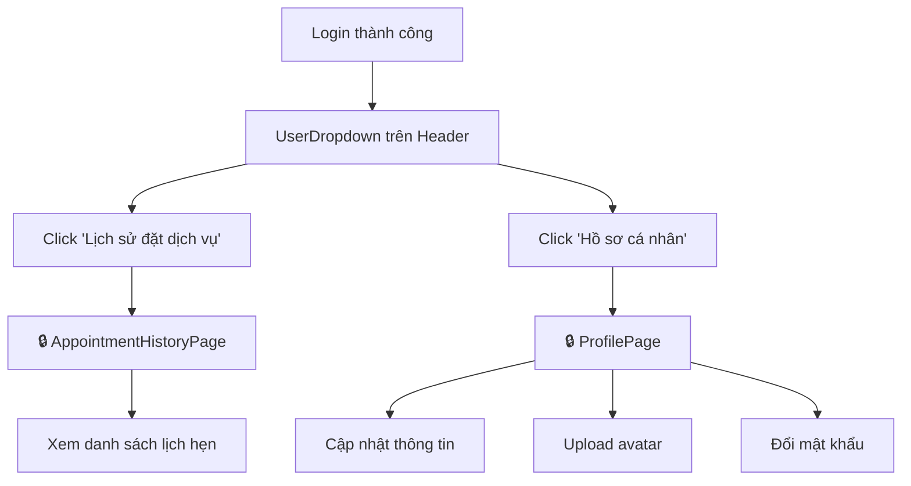

### 7.3 Admin — Quản Trị Hệ Thống

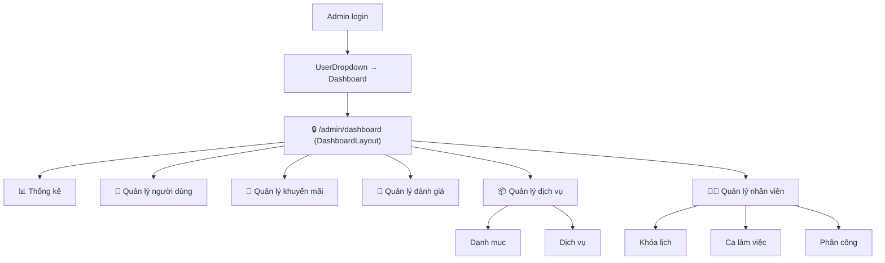

### 7.4 Staff — Xem Lịch Làm Việc

```
Staff login → UserDropdown → Dashboard → /staff/dashboard → StaffDashboardPage (Lịch làm việc)
```

---

## 8. Hệ Thống UI & Theme

### 8.1 Ant Design Theme

File: [app-theme.ts](file:///e:/Dev/source%20code/YoEdu/Appointment_Booking_System_FE/src/shared/theme/app-theme.ts)

| Token | Giá trị | Mô tả |
|-------|---------|--------|
| `colorPrimary` | `#214f45` | Xanh rêu đậm — brand chính |
| `colorSuccess` | `#3f8a65` | Xanh lá |
| `colorWarning` | `#c6862f` | Cam vàng |
| `colorError` | `#c94c4c` | Đỏ nhạt |
| `colorTextBase` | `#17223b` | Navy đậm — text chính |
| `colorBgLayout` | `#f7f4ee` | Kem nhạt — background |
| `fontFamily` | `Inter, ui-sans-serif, ...` | Google Font Inter |
| `borderRadius` | `8` | Bo tròn 8px |

### 8.2 Shared Components

| Component | File | Mô tả |
|-----------|------|--------|
| `DataTable` | [DataTable.tsx](file:///e:/Dev/source%20code/YoEdu/Appointment_Booking_System_FE/src/shared/components/DataTable.tsx) | Wrapper Ant Design Table |
| `AppPagination` | [AppPagination.tsx](file:///e:/Dev/source%20code/YoEdu/Appointment_Booking_System_FE/src/shared/components/AppPagination.tsx) | Pagination component |
| `AppSelect` | [AppSelect.tsx](file:///e:/Dev/source%20code/YoEdu/Appointment_Booking_System_FE/src/shared/components/AppSelect.tsx) | Styled Select |
| `AppRouteError` | [AppRouteError.tsx](file:///e:/Dev/source%20code/YoEdu/Appointment_Booking_System_FE/src/shared/components/AppRouteError.tsx) | Route error boundary |

---

## 9. Cấu Hình & Environment

### 9.1 Vite Config

File: [vite.config.ts](file:///e:/Dev/source%20code/YoEdu/Appointment_Booking_System_FE/vite.config.ts)

- Plugin: `@vitejs/plugin-react`
- Path alias: `@` → `./src`

### 9.2 Environment Variables

| Variable | Mô tả |
|----------|--------|
| `VITE_API_URL` | Base URL của Backend API |
| `VITE_GOOGLE_CLIENT_ID` | Google OAuth Client ID |

### 9.3 Axios Client Config

```typescript
{
  baseURL: import.meta.env.VITE_API_URL,
  withCredentials: true,         // ← Luôn gửi cookie
  headers: { 'Content-Type': 'application/json' }
}
```

---

## 10. Tổng Kết Flow Lifecycle

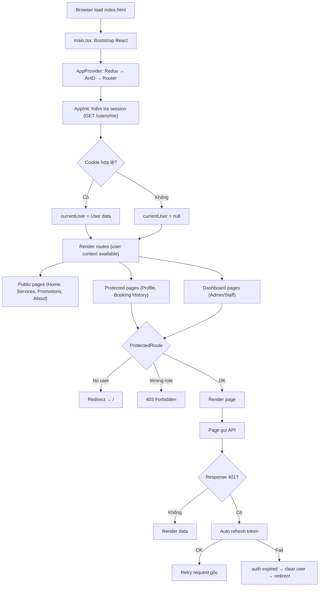

---

## 11. Điểm Đáng Chú Ý

### ✅ Thiết kế tốt

1. **Feature-Sliced Architecture**: Mỗi feature độc lập, dễ scale
2. **Cookie-based auth**: An toàn hơn localStorage, không bị XSS đánh cắp token
3. **Automatic token refresh** với request queue: Tránh race condition
4. **Data mapper pattern**: Tách biệt API contract và FE model
5. **Typed Redux hooks**: `useAppDispatch` & `useAppSelector` an toàn kiểu
6. **Generic `useTable` hook**: Tái sử dụng logic bảng phân trang cho tất cả admin pages
7. **`sessionVersion` pattern**: Trigger re-fetch user sau login/register mà không cần truyền callback

### ⚠️ Lưu ý

1. **Appointments feature dùng mock data**: `appointmentApi` trả về mock data cục bộ (chưa nối API thật)
2. **Không có global error boundary**: Chỉ có `AppRouteError` cho route-level, chưa có top-level ErrorBoundary
3. **Redux chỉ dùng cho auth/user**: Các feature khác dùng local state — phù hợp nếu không cần share state cross-feature

---

> **File được tạo tự động bởi phân tích codebase. Cập nhật lại khi có thay đổi kiến trúc lớn.**
